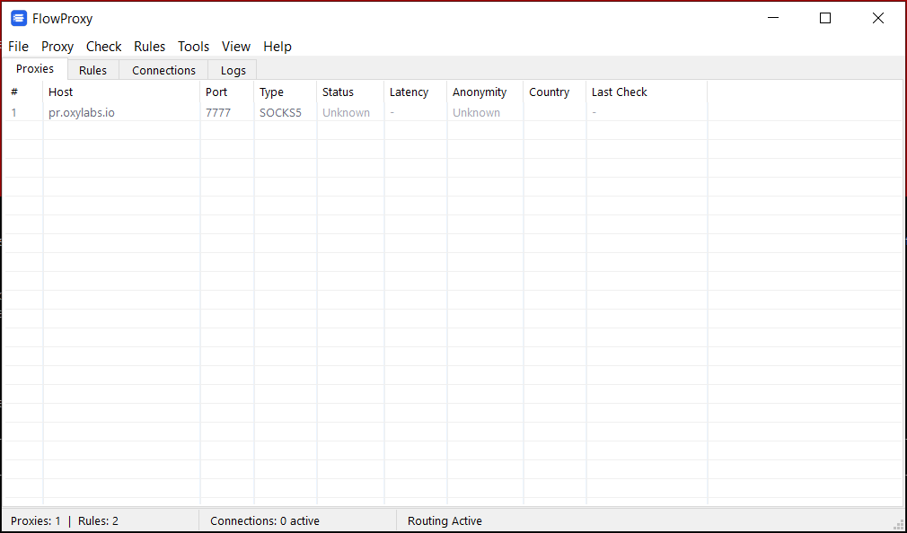

# FlowProxy

A lightweight Windows proxy client and traffic router. Route application traffic through SOCKS5/HTTP proxies with flexible rules — filter by app, domain, and port. Built in pure C++ with a native Win32 GUI, no external dependencies.


---

## What is FlowProxy?

FlowProxy is a system-level proxy client for Windows that gives you full control over which traffic goes through a proxy and which connects directly. Think of it as a simple, open-source alternative to Proxifier — without the price tag or bloat.

It sits between your apps and the internet, intercepting HTTP/HTTPS traffic and routing it based on rules you define. You can target specific applications, domains, IP ranges, or ports — or combine all of them in a single rule.

**Use cases:**
- Route only your browser through a proxy while everything else connects directly
- Send traffic to specific domains (e.g., `*.netflix.com`) through a particular proxy
- Block unwanted connections (telemetry, ads) at the network level
- Chain multiple proxies together for multi-hop routing
- Check and rotate between multiple proxy servers automatically

## Features

- **Flexible Rule System** — Create rules that match by application name, domain/IP, port, or any combination. Rules use AND logic: a rule with `firefox.exe` + `*.netflix.com` + `443` only matches Firefox HTTPS traffic to Netflix
- **Multi-Protocol Support** — HTTP, HTTPS, SOCKS4, and SOCKS5 proxies with authentication
- **Proxy Chains** — Route traffic through multiple proxies in sequence (multi-hop)
- **Drag & Drop Rule Ordering** — Reorder rules by dragging them with your mouse. Specific rules are always evaluated before catch-all rules
- **Real-Time Connection Monitor** — See all system TCP connections with process names, remote addresses, and connection state
- **Traffic Logging** — Full connection log with destination, proxy used, status codes, and CSV export
- **Proxy Checker** — Bulk-check proxy servers for availability, latency, and anonymity level
- **Proxy Rotation** — Automatic rotation across multiple proxies (round-robin, random, or least-used)
- **DNS Leak Prevention** — Resolve DNS through SOCKS5 proxies or custom DNS servers to prevent leaks
- **System Tray** — Minimizes to tray with quick routing toggle
- **Portable** — Single executable, no installation, no runtime dependencies

## Screenshot



## How It Works

FlowProxy runs a local HTTP/SOCKS5 interceptor and sets the Windows system proxy to route all HTTP/HTTPS traffic through it. For each incoming connection, the interceptor:

1. Identifies the source application by looking up the TCP connection in the system table
2. Evaluates your routing rules against the app name, destination host, and port
3. Routes the traffic accordingly:
   - **Rule matches with proxy** → Traffic goes through the specified proxy or chain
   - **Rule matches with direct** → Traffic connects directly, bypassing all proxies
   - **Rule matches with block** → Connection is rejected
   - **No rule matches** → Traffic passes through directly (no proxy overhead)

FlowProxy's own traffic is always excluded from routing to prevent loops. Localhost and internal connections are filtered from the monitor for a clean view.

**What gets routed:** Any application that uses WinINET or WinHTTP (browsers, most desktop apps, curl, wget, etc.)

**What doesn't get routed:** UWP/Store apps (AppContainer loopback restriction), applications using raw sockets, and non-TCP traffic (UDP, ICMP).

## Installation

### Download

Grab the latest release from the [Releases](https://github.com/HorusGod007/FlowProxy/releases) page. No installation needed — just run `FlowProxy.exe`.

### Build from Source

**Requirements:**
- CMake 3.15+
- MSVC (Visual Studio 2019+) or MinGW-w64
- Windows SDK

**MSVC:**
```bash
mkdir build && cd build
cmake .. -G "Visual Studio 17 2022"
cmake --build . --config Release
```

**MinGW-w64:**
```bash
mkdir build && cd build
cmake .. -DCMAKE_TOOLCHAIN_FILE=../toolchain-mingw64.cmake
make -j$(nproc)
```

**Cross-compile from Linux:**
```bash
sudo apt install mingw-w64
mkdir build && cd build
cmake .. -DCMAKE_TOOLCHAIN_FILE=../toolchain-mingw64.cmake
make -j$(nproc)
```

The output binary `FlowProxy.exe` will be in the `build/` directory.

## Usage

### Quick Start

1. Launch `FlowProxy.exe` — routing starts automatically
2. Go to the **Proxies** tab and add your proxy servers
3. Go to the **Rules** tab and create routing rules
4. Check the **Connections** tab to see all system traffic in real time

### Adding Proxies

**Menu:** Proxy → Add Proxy (or press `Insert`)

Enter the proxy host, port, type (HTTP/HTTPS/SOCKS4/SOCKS5), and optional credentials. Click **Check** to test connectivity before saving.

### Creating Rules

**Menu:** Rules → Add Rule

Rules have three optional filter fields. Leave a field empty to match everything. When multiple fields are filled, all must match (AND logic). Within each field, separate multiple entries with newlines — any one matching counts (OR logic).

| Field | Description | Examples |
|-------|-------------|----------|
| **Applications** | Executable names to match (supports `*` and `?` wildcards) | `firefox.exe`, `chrome.exe` |
| **Hosts** | Domain names, IPs, or CIDR ranges | `*.netflix.com`, `192.168.0.0/16` |
| **Ports** | Port numbers, comma-separated or ranges | `80,443`, `1-1024` |
| **Action** | Use Proxy, Direct (bypass), Block, or Use Chain | — |

**Example rules:**

| Rule Name | Applications | Hosts | Ports | Action |
|-----------|-------------|-------|-------|--------|
| Browser via proxy | `firefox.exe` | *(empty = all)* | *(empty = all)* | Use Proxy |
| Netflix direct | *(empty = all)* | `*.netflix.com` | *(empty = all)* | Direct |
| Block telemetry | *(empty = all)* | `*.telemetry.*` | *(empty = all)* | Block |
| Secure only | *(empty = all)* | *(empty = all)* | `443` | Use Proxy |
| Route everything | *(empty = all)* | *(empty = all)* | *(empty = all)* | Use Proxy |

Rules are evaluated top-to-bottom. Drag and drop to reorder. Specific rules (with at least one filter field filled) are always checked before catch-all rules (all fields empty).

### Tabs

| Tab | Description |
|-----|-------------|
| **Proxies** | Manage proxy servers — add, edit, delete, check, import/export |
| **Rules** | Configure routing rules with flexible app/host/port matching |
| **Connections** | Live view of all system TCP connections with process info |
| **Logs** | Traffic log showing all routed and direct connections in real time |

### Keyboard Shortcuts

| Key | Action |
|-----|--------|
| `Insert` | Add new proxy/rule |
| `Delete` | Delete selected |
| `Enter` | Edit selected |
| `Ctrl+I` | Import proxies |
| `Ctrl+E` | Export proxies |
| `Ctrl+S` | Settings |

### DNS Modes

**Menu:** Tools → DNS

| Mode | Description |
|------|-------------|
| **Local DNS** | Uses system DNS (default, fastest) |
| **Remote DNS** | DNS resolution through SOCKS5 proxy (prevents DNS leaks) |
| **Custom DNS** | Route DNS queries to a custom server through proxy |

## Project Structure

```
FlowProxy/
├── src/
│   ├── core/           # Proxy model, checker, importer, rules engine, chains
│   ├── net/            # Socket, SOCKS protocol, interceptor, DNS resolver, connection monitor
│   ├── gui/            # Win32 main window, dialogs, theme
│   ├── utils/          # Settings (INI), system proxy (registry)
│   └── main.cpp        # Entry point
├── resources/          # Win32 resources, icon, manifest
├── CMakeLists.txt      # Build configuration
└── LICENSE             # MIT License
```

## Technical Details

- **Language:** C++17
- **GUI Framework:** Pure Win32 API (no MFC, no ATL, no Qt)
- **Networking:** Winsock2 (ws2_32)
- **System Proxy:** WinINET registry + `InternetSetOption` API
- **Connection Monitoring:** `GetExtendedTcpTable` with PID lookup
- **Process Detection:** `QueryFullProcessImageName` via TCP table
- **Linked Libraries:** ws2_32, wininet, comctl32, shlwapi, iphlpapi, psapi, comdlg32, dwmapi, uxtheme

## Contributing

Contributions are welcome! Feel free to open issues or submit pull requests.

1. Fork the repository
2. Create your feature branch (`git checkout -b feature/my-feature`)
3. Commit your changes
4. Push to the branch (`git push origin feature/my-feature`)
5. Open a Pull Request

## License

This project is licensed under the MIT License — see the [LICENSE](LICENSE) file for details.
